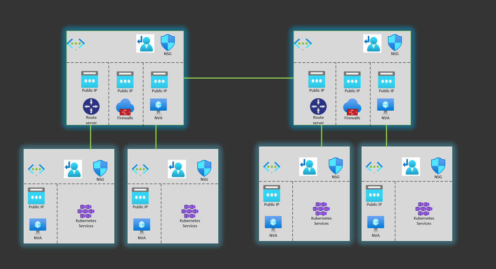
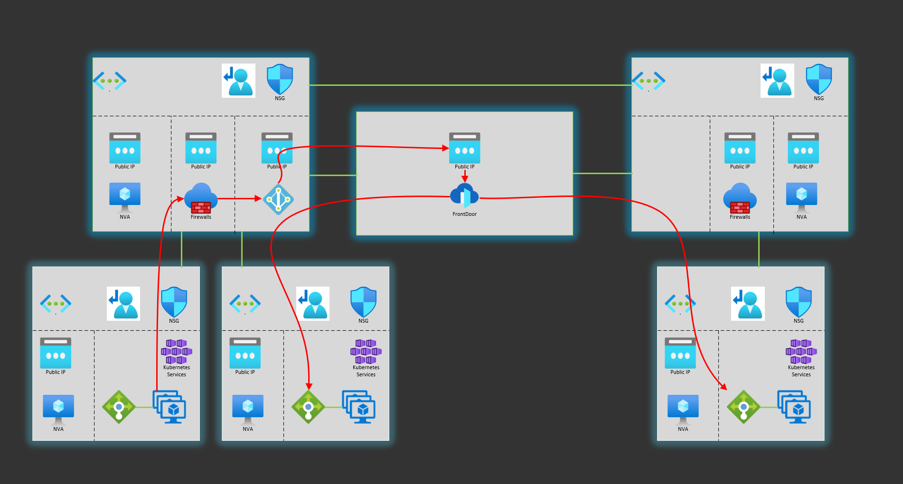

[UNDER CONSTRUCTION]

# Global load balancer architecture design in Azure

The propose of this repo is to test different alternatives to have privat global load balancer across regions in Azure.
The repo contains terraform templates, details instructions and GitHub Actions to make it easy to replicate in your environment.

Currently, it is under development

# Proposal 1: BGP based solution
[](https://github.com/crgarcia12/azure-global-load-balancer/actions/workflows/infra-anycast.yml)




# Proposal 2: Front Door based solution



# Proposal 1: BGP - under development

## Run terraform
```
# Set secrets via environment variables
$env:TF_VAR_SSH_USERNAME=<username>
$env:TF_VAR_SSH_PASSWORD=<password>
$resourceGroup = "crgar-fd-glb-terraform-rg"
$storageName = "crgarfdglbterraformstor"

az group create --name $resourceGroup --location eastus
az storage account create --resource-group $resourceGroup --name $storageName --sku Standard_LRS --encryption-services blob
az storage container create --name tfstate --account-name $storageName

$account_key=$(az storage account keys list --resource-group $resourceGroup --account-name $storageName --query '[0].value' -o tsv)
$env:ARM_ACCESS_KEY=$account_key

az upgrade
az extension add --name aks-preview
az extension update --name aks-preview

az login
az account set --subscription "..." 

az feature register --name CiliumDataplanePreview --namespace Microsoft.ContainerService
az feature show --name CiliumDataplanePreview --namespace  Microsoft.ContainerService --output table

az feature register --name AzureOverlayPreview --namespace Microsoft.ContainerService
az feature show --name AzureOverlayPreview --namespace  Microsoft.ContainerService --output table

az provider register -n Microsoft.ContainerService

terraform init
terraform apply -auto-approve
```

## Setup GitHub actions
```
# You need to be owner to do role assignments for the AKS MSI to the VNet 
az ad sp create-for-rbac --name "crgar-glb-githubaction" --role owner --scopes /subscriptions/{subscriptionid} --sdk-auth

# Create the following GH secrets
AZURE_CLIENT_ID = clientId
AZURE_CLIENT_SECRET = clientSecret
AZURE_TENANT_ID = tenantId
MVP_SUBSCRIPTION = subscriptionId
TF_VAR_SSH_USERNAME = vms-username
TF_VAR_SSH_PASSWORD = vms-password
```

## Configure the VM
``` bash
14:25

# Install frr
sudo dnf install frr
vi /etc/frr/daemons
bgpd=yes (bgp daemon)
systemctl enable frr --now

# Enter Frr config console
sudo vtysh
show running-config
```
```
## See running config
crgar-glb-hub-vm# show running-config
Building configuration...

Current configuration:
!
frr version 7.5
frr defaults traditional
hostname hostname
no ipv6 forwarding
hostname crgar-glb-hub-vm
no service integrated-vtysh-config
!
router bgp 65111
 no bgp ebgp-requires-policy
 no bgp network import-check
 neighbor 10.100.3.4 remote-as 65515
 neighbor 10.100.3.4 ebgp-multihop 2
 neighbor 10.100.3.5 remote-as 65515
 neighbor 10.100.3.5 ebgp-multihop 2
 neighbor 10.200.3.4 remote-as 65515
 neighbor 10.200.3.4 ebgp-multihop 2
 neighbor 10.200.3.5 remote-as 65515
 neighbor 10.200.3.5 ebgp-multihop 2
 !
 address-family ipv4 unicast
  network 6.6.6.6/32
  neighbor 10.100.3.4 route-map PREP out
  neighbor 10.100.3.5 route-map PREP out
 exit-address-family
!
route-map PREP permit 10
 set as-path prepend 65111
!
```

```
crgar-glb-weu-hub-vm# show running-config
Building configuration...

Current configuration:
!
frr version 7.5
frr defaults traditional
hostname hostname
no ipv6 forwarding
hostname crgar-glb-weu-hub-vm
no service integrated-vtysh-config
!
router bgp 65100
 no bgp ebgp-requires-policy
 no bgp network import-check
 neighbor 10.100.3.4 remote-as 65515
 neighbor 10.100.3.4 ebgp-multihop 2
 neighbor 10.100.3.5 remote-as 65515
 neighbor 10.100.3.5 ebgp-multihop 2
 neighbor 10.200.3.4 remote-as 65515
 neighbor 10.200.3.4 ebgp-multihop 2
 neighbor 10.200.3.5 remote-as 65515
 neighbor 10.200.3.5 ebgp-multihop 2
 !
 address-family ipv4 unicast
  network 6.6.6.6/32
  neighbor 10.200.3.4 route-map PREP out
  neighbor 10.200.3.5 route-map PREP out
 exit-address-family
!
route-map PREP permit 10
 set as-path prepend 65100
!
line vty
!
end
```

# Load config
sudo more /etc/frr/daemons

# Ip table configuration
```
sudo iptables -t nat -L -> -t = which table  -L= List
PREROUTING:  DNAT all anywhere 6.6.6.6 to:10.220.4.5    <-    when you see 6.6.6.6 replace the to to the AKS LB
POSTROUTING: MASQUERADE all anywhere 10.220.4.5         <-    return traffic destination IP should also be replaced
OUTPUT:      DNAT all anywhere 6.6.6.6 to:10.220.4.5

# validate:
sudo tcpdump -i eth0 tcp port 8080 -nnn
```

## Build the demo app
```
cd app\src\demo-app

docker login -u crgarcia

docker build -t crgarcia/demoapp:0.5.0 -f .\demo-app\Dockerfile .
docker push crgarcia/demoapp:0.5.0

$clusters = @(
	@("crgar-glb-eus-rg","crgar-glb-eus-aks"),
	@("crgar-glb-weu-rg","crgar-glb-weu-aks"),
	@("crgar-glb-weu-s1-rg","crgar-glb-weu-s1-aks"),
	@("crgar-glb-weu-s2-rg","crgar-glb-weu-s2-aks")
)

$clusters | % {
	az aks get-credentials -g $_[0] -n $_[1]
	kubectl apply -f ..\..\deployment\deployment.yaml
}

curl <demoapp k8s-service ip>:8080/api/envs
```

## Approve the VM plan from the marketplace
```
az vm image accept-terms --urn eurolinuxspzoo1620639373013:centos-8-5-free:centos-8-5-free:latest
```

# Setting up VM - notes from a session with Federico
```
1) Install frr and set it as daemon  
sudo dnf install frr
sudo vi /etc/frr/daemons
sudo systemctl enable frr --now
sudo vtysh

2) What route servers do we want to talk to?
# configure terminal  <- enter the config terminal
# router bgp 65222    <- who am I
# bgp ebgp-requires-policy <- NOT FOR PROD! this allows all bgp rules to be received
# neighbor 10.222.3.5 remote-as 65515 <- configure other bgp (neighbour) called 65515 (all Azure BGP servers) at the peer ips of the route server
# neighbor 10.222.3.5 ebgp-multihop 2 <- tell your neighbor that vm is a different subnet! you need to say how many hops (2) are in between. Azure Route Server is 2. 
--- now do the same for the other peer Ip of the ARS
# Ctrl+Z

3) Check that BGP connections are happening
# show ip bgp

4) Now is time to send routes to the ARS
# sudo vtysh
# (config) router bgp
# (config-router) no bgp network import-check <- NOT FOR PROD! this allows all bgp rules to be propagated
# (config-router) address-family ipv4 unicast <- enter the ipv4 family configs
# (config-router-af) network 6.6.6.6/32

# show ip bgp
*> 6.6.6.6/32 <- routes from my route table ready to be propagated

5) now we have a problem, both NVA can handle the same traffic. how to prio?
5.1) Create a route map, that will prepend the tag
# (config) route-map
# (config) route-map PREPEND65111
# (config) route-map PREPEND65111 permit
# (config) route-map PREPEND65111 permit 10 <- 10 is a priority number, to srot routes
# (config-map) set as-path prepend
# (config-map) set as-path prepend 65111

5.2) Enable the transformation to the OUTbound traffic going to 10.222.3.5
# (config) router bgp
# (config-router) address-family ipv4 unicast 
# (config-router-af) neighbor 10.222.3.5 route-map  PREPEND65111 out <-

6) Let's store the config!   
# write

7) check all the configs: 
show ip bgp neighbors 10.111.3.4 advertised-routes

8) now, let's do iptables! 
8.1) Let's receive packages for a virtual ip. this is called forwarding in the linux kernel
sudo sysctl -w net.ipv4.conf.all.forwarding=1 <- allow ip forwarding in the kernel
vi /etc/sysctl.d/50-sysctl
net.ipv4.conf.all.forwarding=1

8.2) 
# sudo iptables -t nat -A PREROUTING -d 6.6.6.6/32 -j DNAT --to-destination 10.113.4.33
# sudo iptables -t nat -A POSTROUTING -d 10.113.4.33 -j MASQUERADE  
# sudo iptables -t nat -A OUTPUT -d 6.6.6.6/32 -j DNAT --to-destination 10.113.4.33


9) how to test?
# sudo vttsh
# configure terminal
# router bgp
# no network 6.6.6.6/32
# network 6.6.6.6/32


Do you have any probems?
vtysh# clear ip bgp * <- clear bgp connections

```

# Turn off VMs and Fw

$firewallsRgs = @("crgar-fd-weu-hub-rg", "crgar-glb-eus-hub-rg", "crgar-glb-eus-hub-rg")
$firewallsNames = @("crgar-fd-weu-hub-fw", "crgar-glb-eus-hub-fw", "crgar-glb-eus-hub-fw")

for ($i=0; $i -th $firewallsRgs.Count; $i++ ) {
    $azfw = Get-AzFirewall -Name $firewallsNames[$i] -ResourceGroupName $firewallsRgs[$i] 
    $azfw.Deallocate()
    Set-AzFirewall -AzureFirewall $azfw
}