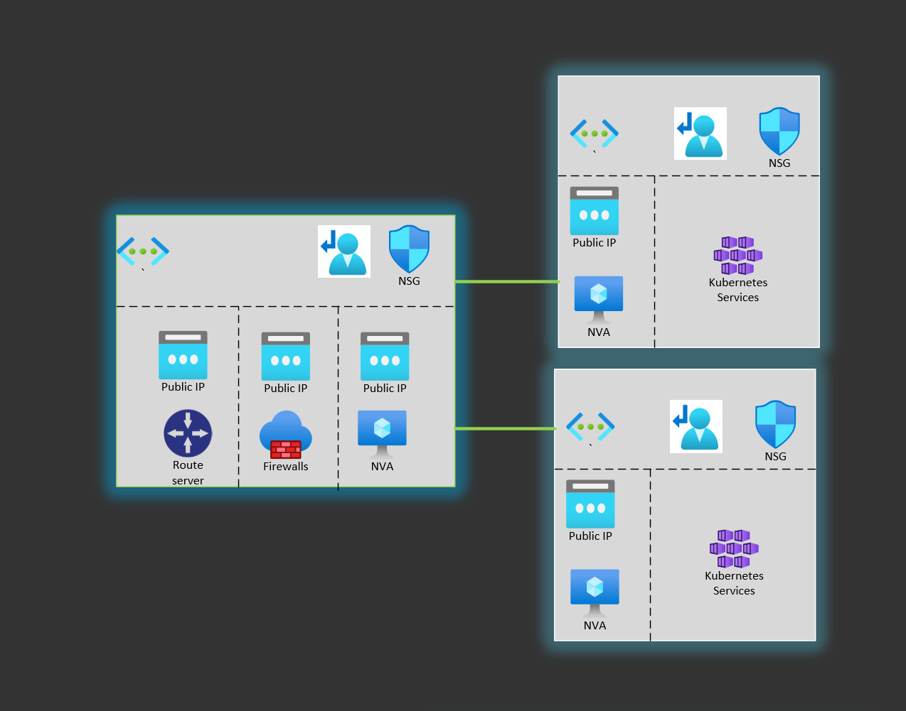

# Global load balancer design in Azure



## Run terraform
```
az group create --name crgar-glb-terraform-rg --location eastus
az storage account create --resource-group crgar-glb-terraform-rg --name crgarglbterraformstor --sku Standard_LRS --encryption-services blob
az storage container create --name tfstate --account-name crgarglbterraformstor

$account_key=$(az storage account keys list --resource-group crgar-glb-terraform-rg --account-name crgarglbterraformstor --query '[0].value' -o tsv)
$env:ARM_ACCESS_KEY=$account_key

az upgrade
az extension add --name aks-preview
az extension update --name aks-preview

az login
az account set --subscription "..." 

az feature register --name CiliumDataplanePreview --namespace Microsoft.ContainerService
az feature show --name CiliumDataplanePreview --namespace  Microsoft.ContainerService --output table

az feature register --name AzureOverlayPreview --namespace Microsoft.ContainerService
az feature show --name AzureOverlayPreview --namespace  Microsoft.ContainerService --output table

az provider register -n Microsoft.ContainerService

terraform init
terraform apply -auto-approve
```

## Setup GitHub actions
```
az ad sp create-for-rbac --name "crgar-glb-githubaction" --role contributor --scopes /subscriptions/{subscriptionid} --sdk-auth

# Create the following GH secrets
AZURE_CLIENT_ID = clientId
AZURE_CLIENT_SECRET = clientSecret
AZURE_TENANT_ID = tenantId
MVP_SUBSCRIPTION = subscriptionId

```

## VM script
``` bash
# SSH to NVA
sudo apt --assume-yes update
sudo apt --assume-yes upgrade
sudo apt --assume-yes install exabgp
sudo apt --assume-yes install haproxy
# Loopback IF
sudo ifconfig lo:9 9.9.9.9 netmask 255.255.255.255 up
# ExaBGP config
cat > exabgp-conf.ini << EOF
neighbor 172.16.159.4 {
	router-id 172.16.156.70;
	local-address 172.16.156.70;
	local-as 65010;
	peer-as 65515;
	static {
	route 9.9.9.9/32 next-hop 172.16.156.70 as-path [];
	}
}
neighbor 172.16.159.5 {
	router-id 172.16.156.70;
	local-address 172.16.156.70;
	local-as 65010;
	peer-as 65515;
	static {
	route 9.9.9.9/32 next-hop 172.16.156.70;
	}
}
EOF
## HAProxy config
sudo chmod 777 /etc/haproxy/haproxy.cfg
cat >> /etc/haproxy/haproxy.cfg << EOF
frontend http_front
        bind *:80
        stats uri /haproxy?stats
        default_backend http_back
backend http_back
        balance roundrobin
        server backend01 172.16.156.69:80 check
EOF

sudo systemctl restart haproxy

## Start ExaBGP
exabgp ./exabgp-conf.ini
```

# Build the demo app
```
cd app\src\demo-app

docker login -u crgarcia
docker build -t crgarcia/demoapp:0.1.0 -f .\demo-app\Dockerfile .
docker push crgarcia/demoapp:0.1.0

kubectl apply -f ..\..\deployment\deployment.yaml
```

